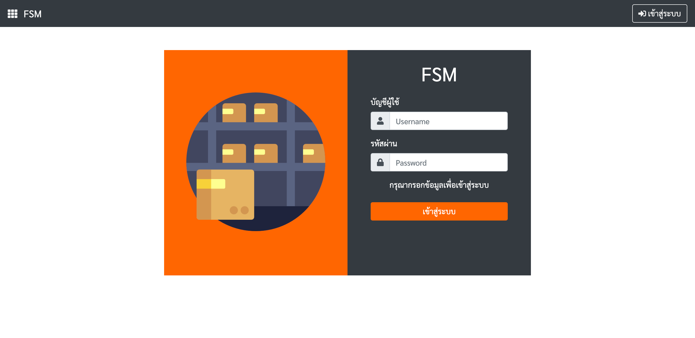
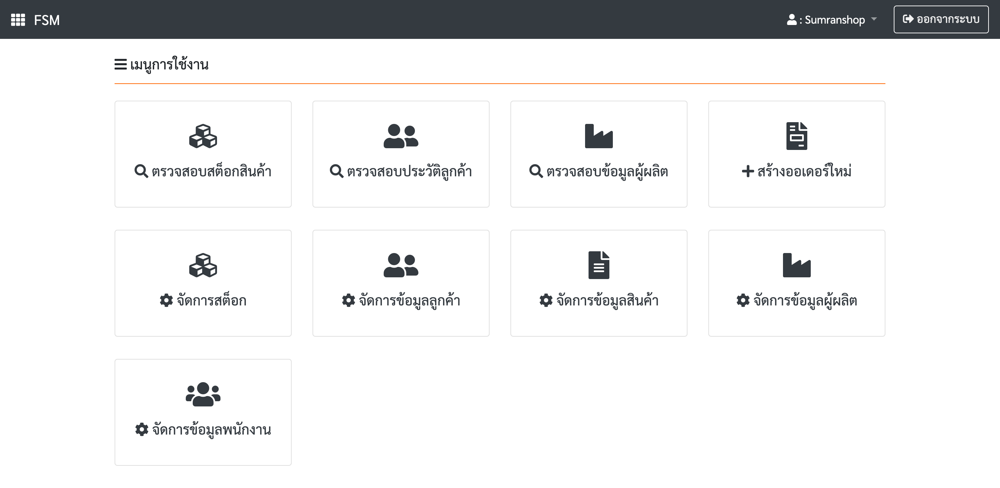
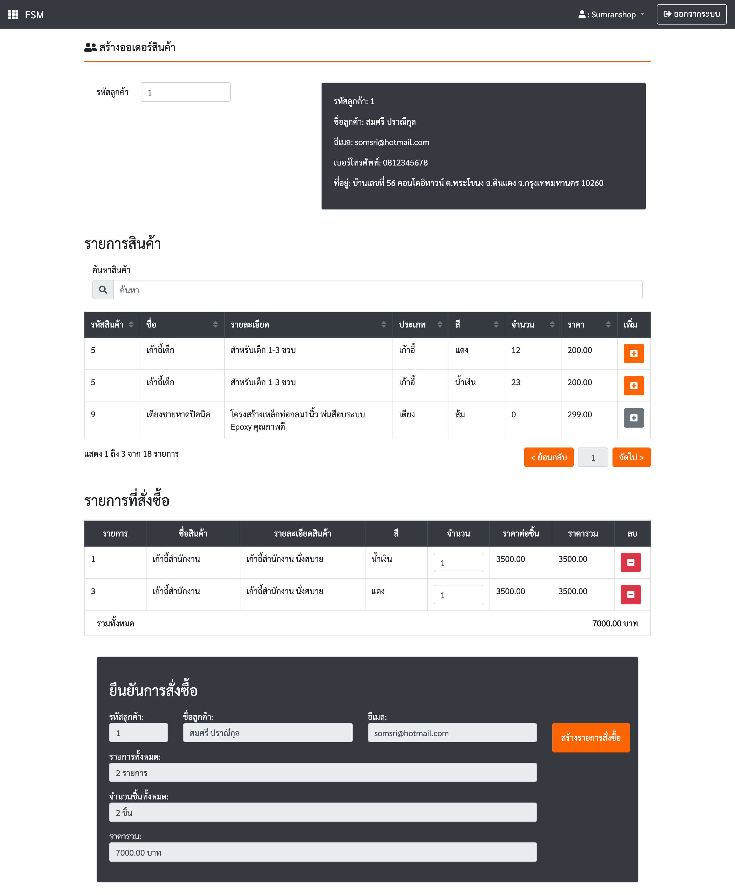
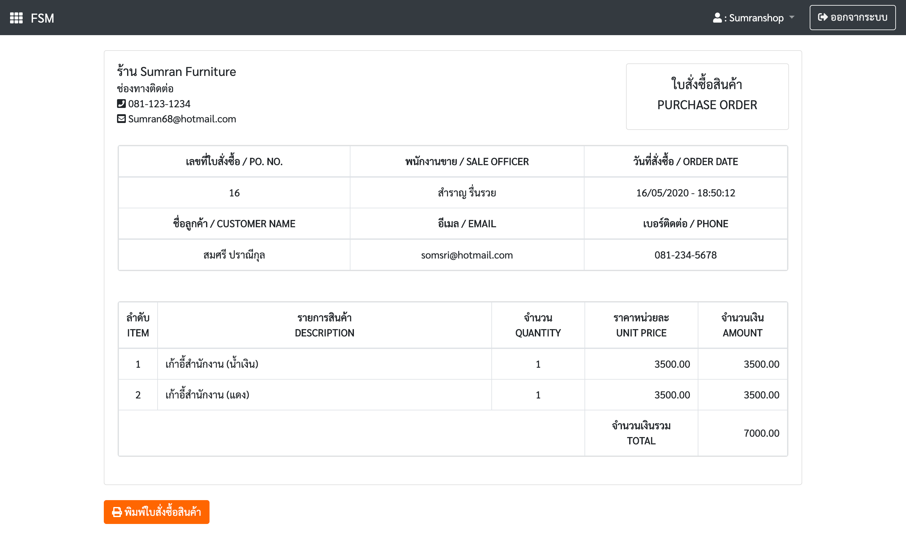
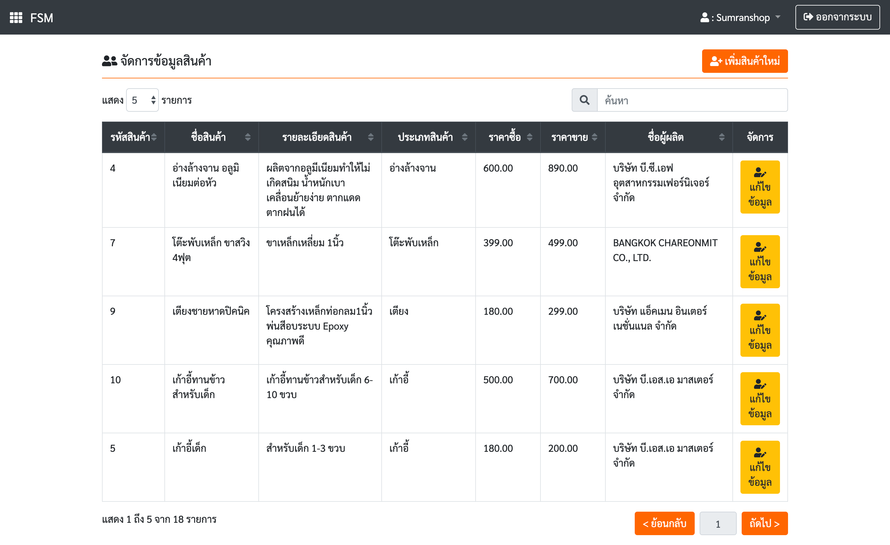
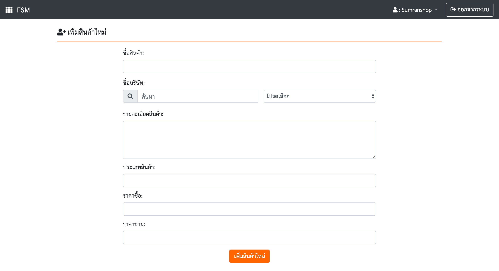

# Furniture Shop Management
This repository consists of codes of "Web programming (WebPro)" Project, Faculty of Information Technology, King Mongkut's Institute of Technology Ladkrabang (KMITL).
______
# Preview
### • Login

### • Menu

### • Create Order

### • Purchase Order

### • Manage

### • Add

______
# Team Member
|||
|:-----:|:-----:|:-----:|
|[chattida](https://github.com/chattida)|[max180643](https://github.com/max180643)|[NAPATKRUP](https://github.com/NAPATKRUP)|
#### รายชื่อสมาชิก
- นางสาว ฉัตรธิดา แจ้งใจ 61070029
- นาย ชาญวิทย์ เศรษฐวงศ์สิน 61070040
- นาย ณภัทร อารยวัฒนาพงษ์ 61070045
